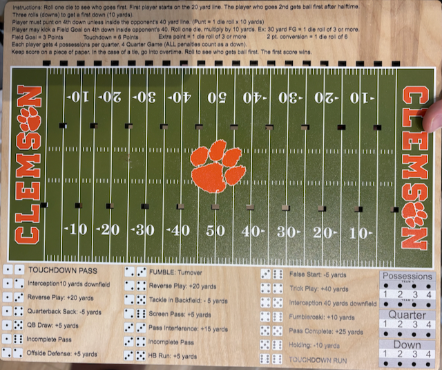

# Dice Football Game

A digital version of the classic dice football board game, built with React and Vite.

## Claude Code Experiment

This game was created as an AI experiment.

1. I took pictures of a wooden board game in a store.
2. I fed the pictures into ChatGPT to build a complete understanding of the game
   from the pictures. I asked it to write out this understanding, as well as its
   proposed implementation overview to a markdown file.
3. I fed this markdown file into Claude Code and asked it to review the game
   and the proposed implementation overview and come up with its own plan for
   how to implement it. I asked it to implement its plan.

After the first implementation, I issued a few follow-up prompts for one major
bug and to improve some layout:

1. Major bug: explain that when posession of the ball changes, the direction of
   play changes. Its first implementation had play continuing in the same
   direction.
2. Adjust layout so that more was visible on the screen at once. (Only tested on
   desktop.)
3. Ask it to add visual indication of who currently has the ball other than the
   info in the game log.



## Features

- **Complete game mechanics**: downs, possessions, scoring, field goals
- **Interactive dice rolling**: animated dice with realistic outcomes
- **Real-time game state**: track position, score, quarter, and downs
- **Play log**: see history of all plays
- **Responsive design**: works on desktop and iPad
- **Special plays**: touchdowns, interceptions, fumbles, penalties

## How to Play

1. Start the game by rolling for first possession
2. Roll the dice to determine play outcomes
3. Advance down the field to score touchdowns
4. Manage 4 downs to gain 10 yards
5. Score points via:
   - Touchdown: 6 points
   - Extra point: 1 point (roll ≥3)
   - 2-point conversion: 2 points (roll = 12)
   - Field goal: 3 points (distance-based)
   - Safety: 2 points

## Development

```bash
# Install dependencies
npm install

# Run development server
npm run dev

# Build for production
npm run build

# Preview production build
npm run preview
```

## Deployment

The game is ready to deploy to Vercel:

1. Push to GitHub
2. Import project in Vercel
3. Deploy with default settings

## Tech Stack

- React 19
- Vite 7
- CSS Grid for responsive layout
- CSS animations for dice rolling
